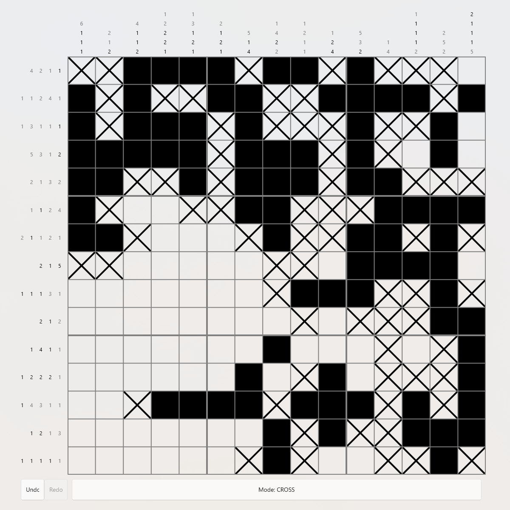

# NonoSharp
[](https://www.nuget.org/packages/NonoSharp/)
[](https://www.nuget.org/packages/NonoSharp/)
[](https://github.com/GiraffeLars/NonoSharp/actions/workflows/test-api.yml)

A Nonogram library built with C# featuring Nonogram puzzle playing, randomly generated puzzles, easy Nonogram creation, saving/loading pre-made puzzle solutions and a custom Nonogram solver.

> Status: Published on [NuGet](https://www.nuget.org/packages/NonoSharp/) as an initial development release (v0.\*.\*).

<p>
    
    <em><br>Example of a project built on top of NonoSharp, <a href="https://github.com/GiraffeLars/NonoSharp-Maui">NonoSharp-Maui</a>. </em>
</p>

## What is NonoSharp?
NonoSharp is a Nonogram library for C#, allowing for easy creation and playing of [Nonogram](https://en.wikipedia.org/wiki/Nonogram) (also known as Picross) puzzles.
Furthermore, NonoSharp includes a Nonogram solver, allowing you to solve any Nonogram puzzle you might encounter, and various other features.
Nonograms are Japanese puzzles where you fill in a picture based on clues given to you.
The clues, either on the left-side or top-side of the grid, show how many groups there are in a given row/column and show how many cells each group consists of.
By filling the grid one cell at a time, eventually you reach the solution.
NonoSharp is paired with an [example UI consumer](https://github.com/GiraffeLars/NonoSharp-Maui), NonoSharp-Maui.

Currently the library is split into the following components:
- **Nonogram puzzle playing**: Generate, load, save and play Nonogram puzzles, just like you would for any other Nonogram game.
- **Nonogram solving**: Solve any Nonogram puzzle you might encounter, either by using the built-in solver.
- **Nonogram creation**: Create your own Nonogram puzzles, either by using the Nonogram builder.

## Features
- **A fully functional Nonogram game**, complete with cell operations, clue checking and solved-state checking
- An abstracted **Nonogram API** allowing for game logic to be reused in other projects
- A **custom solver** allowing you to solve any Nonogram puzzle
- **Randomly generated puzzles** guaranteed to be uniquely solvable as verified by the built-in solver
- **Saving and loading solutions** to/from custom file format optimised for file size
- A **Nonogram builder** allowing you to create your own Nonogram puzzles quickly and easily
- And more!

## Using the library
Since NonoSharp is a library and not a ready-to-play Nonogram game with UI, it is to be used in other projects. To add the library
to your project, you can install it from [NuGet](https://www.nuget.org/packages/NonoSharp),
for example by running the following command. This will install the latest version and add it to
your project.
```shell
dotnet add package NonoSharp
```

### Documentation
Documentation for the API is found on this repo's GitHub pages, 
[here](https://giraffelars.github.io/NonoSharp/).

## Example usage
### Nonogram playing
NonoSharp is designed to be easy to use. The example below shows how to create a random Nonogram puzzle, perform cell operations and check the puzzle's solved state.
Furthermore, it shows how to access the clues for each row and column, and subscribes to one of the handy events.

```csharp
using NonoSharp;

// Creates a new random 10x10 puzzle. Generation is guaranteed to produce a solvable puzzle.
// This method is also available asynchronously via Nonogram.CreateRandomPuzzleAsync
var nonogram = Nonogram.CreateRandomPuzzle(10, 10); // (width x height)
 
// Fill in or cross a cell (coordinates are zero-indexed, (0, 0) is top-left)
nonogram.FillCell(2, 3);
nonogram.CrossCell(0, 0);
 
// Moves can be undone/redone
if (nonogram.CanUndo)
{
    nonogram.Undo();
}
 
// Check individual cell state
bool isFilled = nonogram.IsCellFilled(2, 3);
 
// Check overall progress
if (nonogram.IsPuzzleSolved())
{
    Console.WriteLine("Solved!");
} 
else 
{
    Console.WriteLine("Not solved :(");
}

 
// The clues shown alongside the grid (e.g. "3 1" for a row) are available for building your own UI
Clues[] columnClues = nonogram.ColumnClues;
Clues[] rowClues = nonogram.RowClues;

// There are also some events provided
nonogram.CellStateChanged += (s, e) => {
    Console.WriteLine("A cell has changed states");
};
```

### Nonogram creation
NonoSharp's `NonogramBuilder` class allows you to create your own Nonogram puzzles quickly and easily, while
ensuring puzzles remain uniquely solvable.
```csharp
using NonoSharp;

NonogramBuilder builder = NonogramBuilder.FromString(
    " O O \n" +
    "     \n" +
    "     \n" +
    "O   O\n" +
    "OOOOO",
    "Smiley");

if (builder.IsSolvable())
{
    Nonogram puzzle = builder.ToNonogram();
    puzzle.SaveAsFile("smiley.ns");
}
```

### Solving Nonograms
As mentioned, NonoSharp comes with a custom Nonogram solver. This can be used to solve any Nonogram puzzle.
```csharp
using NonoSharp;

Clues[] columnClues =
[
    new Clues(3),
    new Clues(1),
    new Clues(3),
];
Clues[] rowClues =
[
    new Clues(3),
    new Clues(1, 1),
    new Clues(1, 1),
];

var solvable = Solver.IsSolvable(3, 3, columnClues, rowClues, out var solution);
```


## Getting Started
### Playing
To play a Nonogram game built on top of NonoSharp, install the beta release for Windows in the [Releases](https://github.com/GiraffeLars/NonoSharp-Maui) tab of the [NonoSharp-Maui GitHub Repo](https://github.com/GiraffeLars/NonoSharp-Maui), or create your own!

### Contributing
To contribute, clone the project and open it in your prefered IDE, such as Visual Studio. The project makes use of [.NET 10.0](https://dotnet.microsoft.com/en-us/download/dotnet/10.0).

### Building the project
After setting everything up, you can follow the regular workflow for building .NET projects:
```
dotnet build
```
This will build the library and the unit tests.

If you wish to build just the core library, run
```
dotnet build src/NonoSharp/NonoSharp.csproj
```

Of course, you are also welcome to use your IDE's debugger to build the project.

### Unit tests
The project is paired with a test suite found in `tests/NonoSharp.Tests`. To run the tests, either use your IDE's unit testing features or run the following:
```
dotnet test tests/NonoSharp.Tests/NonoSharp.Tests.csproj
```
When contributing, please ensure that the unit tests all pass. These will also be checked when opening a pull request.

## Roadmap
Features that are currently planned to be added *(in no particular order)*:
- [x] ~~Random puzzle generation that have a guaranteed solution~~
- [x] ~~Automatically cross the remaining blank cells upon line completion~~
- [x] ~~Support for pre-made puzzles~~
- [x] ~~Player-created puzzles and puzzle creator~~
- [x] ~~Settings for consumers, such as toggling auto crosses or enabling automatic correction when a cell was filled incorrectly~~
- [x] ~~Optimise Solver used for random puzzle generation and make it available publicly~~
- [ ] Convert pictures to Nonograms
- [ ] Getting hints when stuck solving a puzzle

## Contribution guidelines
This project started as a solo learning project, but contributions are welcome. Please open a PR or an issue if you wish to contribute. 

When submitting a pull request, please make note of the following:
- No AI generated code! 
- Keep PRs focussed
- If you make any changes to the logic, ensure that the tests verify
- Make sure the project builds and functions as intended
- Keep code documented

## License
This project is licensed under the **MIT License**. See the `LICENSE` file.
